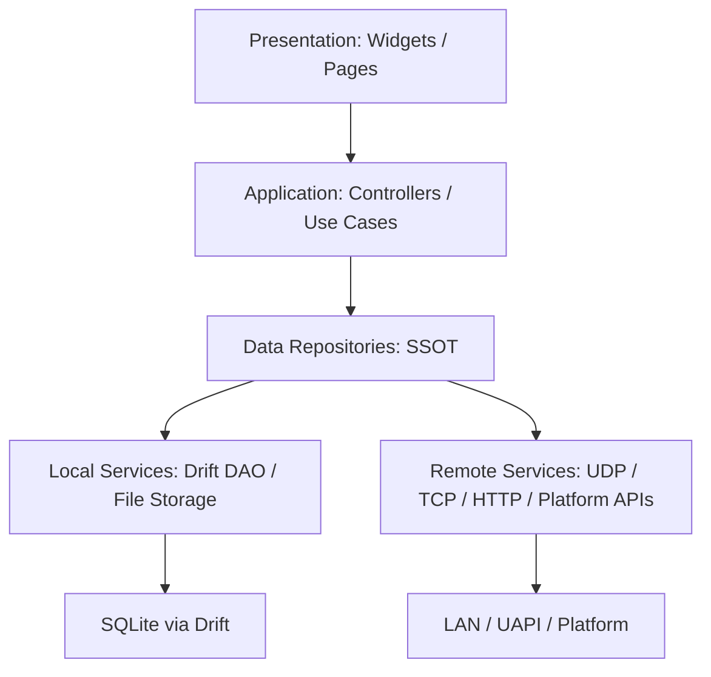
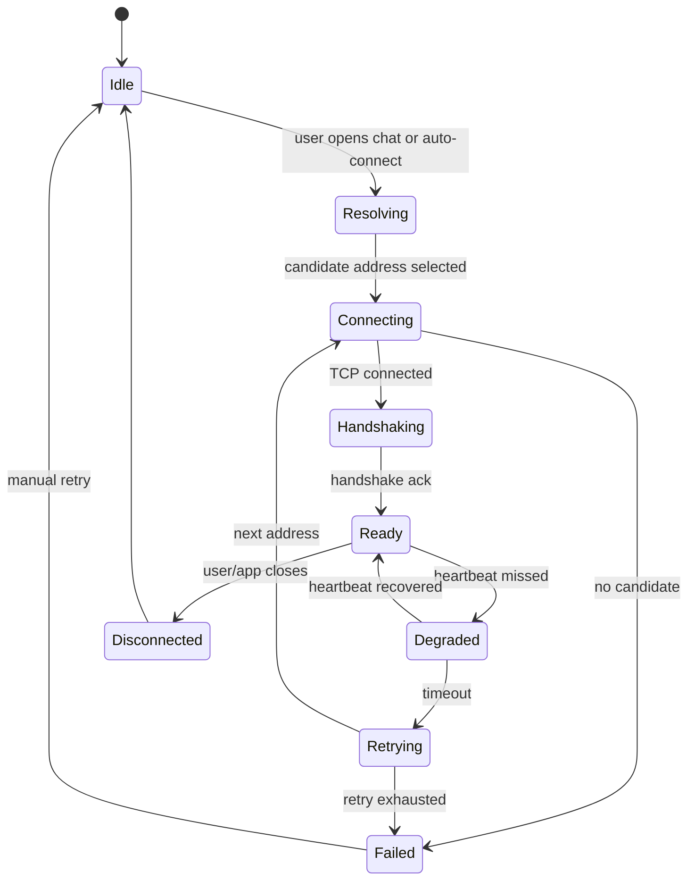
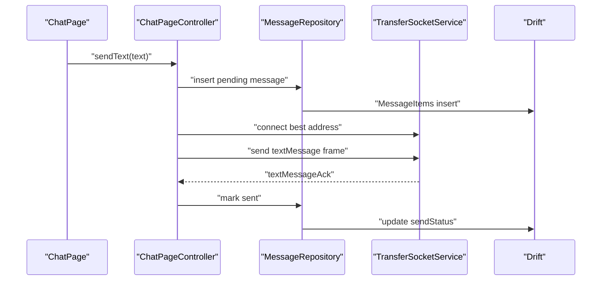

# Hydrop 架构设计

更新时间：2026-05-14

本文用于承接 `README.md` 中规划的功能，并把“要做什么”拆解成可实现、可测试、可逐步调整的架构方案。文档偏设计稿，不要求一次性全部实现；后续每次改动可以直接在对应章节调整字段、协议和阶段任务。

## 1. 设计目标

- Hydrop 是局域网文件传输软件，核心闭环是：发现设备 -> 选择可用连接 -> 保持连接 -> 发送消息/文件 -> 本地持久化历史。
- 本地数据库作为 Single Source of Truth，UI 不直接操作 Drift、Socket、Dio 或平台 API。
- 网络层先用 UDP 做发现，用 TCP 做可靠消息和文件传输；后续可以在不重写 UI 的情况下替换传输实现。
- `lib/data` 目录继续只保留 `local` 和 `remote` 两个顶层边界。
- 功能实现按 MVP 递进：文本消息先闭环，图片/视频/文件复用同一套附件和传输任务。
- 所有关键状态都要可恢复：设备记忆、连接质量、消息状态、附件进度不只存在内存里。

## 2. 当前代码基线

### 已具备能力

- `lib/data/local` 已有 Drift 数据库、DAO、Repository 和 Riverpod provider。
- 已有本地表：`DeviceItems`、`DeviceAddressItems`、`ConnectionSessionItems`、`SettingItems`、`MineItems`、`MessageItems`、`MessageAttachmentItems`、`PointItems`。
- `DeviceRepository` 暴露 `watchDevices()`、`saveDiscoveredDevice()`、`updateConnectionStatus()`。
- `MessageRepository` 暴露 `watchConversation()`、`sendTextMessage()`、`saveReceivedMessage()`。
- `SettingRepository` 已接入 `AppThemeMode`，`MainApp` 通过 `settingsProvider` 驱动 `ThemeMode`。
- `MineRepository` 已支持 `getMineProfile()`、`initializeMineProfile()`、`ensureMineProfile()`，可初始化并复用稳定 `deviceId`。
- `bingWallpaperProvider` 已能请求 UAPI、下载 4K 图片到 Downloads/`bing_wallpaper`，并清理旧图。
- `ImageWidget` 已支持网络、文件、asset、data URI 自动识别；网络分支已接入 `cached_network_image`，空 URL、加载中和加载失败会显示灰色占位，失败态可通过可选回调重试。
- `lib/application/mine/mine_page_state.dart` 已作为首个 application 层落地，负责编排本机 profile 与局域网地址概览。
- `HdPageScaffold`、`HdGlassHeader`、`HdGlassPanel`、`HdGlassDock` 已完成抽象，并已用于 `AppPage`、`HomePage`、`ChatPage`、`MinePage` 的主视觉骨架。
- `MinePage` 已能展示 `displayName`、`hostName`、`deviceId` 和基础本地可用 IP 列表，并支持手动刷新。
- `LocalNetworkAddressService` 已作为共享地址枚举服务抽出，`DiscoveryBroadcastService` 已按所有本机可用 IPv4 源地址建立多网卡 UDP 广播。
- `network_info_plus: ^8.1.0` 已接入，Wi-Fi 的网关 / 子网 / 广播元数据会合并到本机地址与广播 payload。
- `MinePage` 已接入二维码连接：本机二维码包含设备 ID、TCP 端口、能力列表和本机可用地址；扫描对方二维码后写入设备和地址，并触发轻量测速。扫描端使用 `mobile_scanner`，Windows 不启用扫描入口。

### 主要缺口

- 网络接口枚举已经共享到 `LocalNetworkAddressService`；基础地址过滤与排序已落地，Wi-Fi 场景下的广播地址、网关和子网元数据也已补齐，剩余风险主要在平台返回值差异。
- UDP 广播发送/监听、payload 编解码、nonce 去重、自设备过滤、发现设备和地址回写、发现 TTL 扫描已经落地；生命周期调度仍待实现。
- 二维码连接已作为不依赖 UDP 广播的手动配对路径落地；后续仍需把扫描成功后的设备选择、聊天入口和连接状态 UI 打通。
- TCP frame 编解码、基础 TCP server/client、轻量测速服务和文件传输断点续传已经落地；连接管理器、连接状态机、心跳和通用断线重连仍待实现。
- 设备记忆已有 `DeviceAddressItems` / `ConnectionSessionItems` 数据结构，discovery 回写、TTL 过期标记和主动测速刷新已经落地，但还缺 UI 展示闭环。
- 消息表和附件表的扩展字段已经落地，文本消息已具备 `textMessage` / ACK 收发链路和页面交互闭环；后续仍缺统一发送队列、重试和连接状态机。
- 聊天页已按 `remoteDeviceId` 绑定会话并提供文本发送 UI；后续需要补齐失败重试、连接状态和媒体入口。

### 规划新增依赖

这些依赖是功能规划的一部分，落地时需要同步更新 `pubspec.yaml`、`pubspec.lock` 和对应测试。

| 依赖 | 版本 | 用途 | 设计约束 |
| --- | --- | --- | --- |
| `network_info_plus` | `^8.1.0` | 获取 Wi-Fi IP、网关、子网掩码、广播地址等信息 | 作为 `NetworkInterface.list()` 的补充，不作为唯一地址来源 |
| `qr_flutter` | `^4.1.0` | 渲染本机连接二维码 | 只负责展示二维码，payload 编解码放在 application 层 |
| `mobile_scanner` | `^7.2.0` | 扫描对方连接二维码 | Android / iOS / macOS / Web 可用；Windows 不启用扫描入口 |
| `cached_network_image` | `^3.4.1` | 网络图片缓存、占位、错误态 | 已接入 `ImageWidget` 的网络分支，文件/asset/data URI 仍走对应原生 provider |

## 3. 分层原则

采用 Flutter 推荐的 UI / Logic / Data 分层。



### 依赖规则

- `presentation` 只依赖 `application` 暴露的页面状态和控制器 provider，不直接依赖 DAO、Socket、Dio 或 repository provider。
- `application` 编排多个 repository/service，负责状态机、发送队列、重试和用户动作；UI 调用时优先使用无参或少量入参的方法。
- `data/local` 负责 Drift、文件索引、本地持久化和本地查询。
- `data/remote` 负责外部数据源，包括 UAPI、UDP/TCP Socket、平台网络接口。
- `core` 放纯工具、错误类型、协议常量、日志封装、时间/ID 生成器。
- 生成文件继续提交，但不要手改 `*.g.dart`。
- repository provider 仍保留给 application 层组合使用，不再作为页面的首选入口。

### 建议目录结构

```text
lib/
  app.dart
  core/
    error/
      hydrop_exception.dart
    protocol/
      hydrop_protocol.dart
      frame_codec.dart
    theme/
    utils/
  data/
    local/
      database.dart
      dao/
      model/
      repository/
      storage/
        attachment_storage.dart
      migration/
        migration_v2.dart
    remote/
      dio_provider.dart
      service/
        network_interface_service.dart
        discovery_socket_service.dart
        transfer_socket_service.dart
      repository/
        bing_wallpaper_repository.dart
  application/
    app/
      app_runtime.dart
    home/
      home_page_state.dart
    mine/
      mine_page_state.dart
      connection_qr_controller.dart
    discovery/
      discovery_controller.dart
    connection/
      connection_manager.dart
      connection_state_machine.dart
      speed_test_runner.dart
    messaging/
      chat_controller.dart
      outbound_message_queue.dart
    transfer/
      file_transfer_coordinator.dart
      transfer_chunker.dart
  presentation/
    pages/
    widgets/
  routes/
```

说明：`application` 是建议新增的逻辑层。它不破坏 `lib/data` 只能有 `local` / `remote` 两个顶层目录的约束。
当前 `main` 已开始按模块整理 application API：

- `appRuntimeProvider` 统一启动发现和 TCP server，`MainApp` 不再直接 watch 底层 controller。
- `appThemeModeProvider` 统一把设置表状态转换为 `MaterialApp` 可消费的 `ThemeMode`。
- `homeDeviceListProvider`、`homeBackgroundImageProvider` 和 `homePageControllerProvider` 统一承接首页设备列表、背景图和页面动作。
- `mineOverviewProvider`、`connectionQrControllerProvider` 和 `connectionQrScanSupportedProvider` 统一承接我的页本机信息和二维码连接动作。

后续发现、连接、消息编排应沿用同样边界继续扩展，避免页面直接读取 repository 或 service。

## 4. 核心数据设计

当前实现记录（2026-05-10）：

- [x] `schemaVersion` 已升级到 V2，并补齐 V1 -> V2 迁移测试。
- [x] `DeviceAddressItems` / `ConnectionSessionItems`、对应 DAO / Repository 已完成数据层实现。
- [x] 消息表和附件表的核心扩展字段已落地，支持消息状态和附件媒体元数据持久化。
- [x] 本机 `deviceId` 已补充哈希生成工具和 `MineRepository.initializeMineProfile()` 初始化入口。
- [ ] 网络发现、连接状态机、真实收发链路和 UI 消费仍待接入。

### 4.1 现有表保留策略

- `MineItems`：本机设备信息。必须生成稳定 `deviceId`，该 ID 要与当前设备绑定，清除 app 数据后也应尽量生成相同结果。
- `DeviceItems`：远端设备主表。`deviceId` 作为业务唯一键，展示名和整体连接状态写在这里。
- `MessageItems`：消息主表。后续需要增加消息类型、发送状态、幂等字段。
- `MessageAttachmentItems`：附件表。后续需要从“文件保存状态”扩展为“传输和媒体元数据”。
- `SettingItems`：设置表。继续承载主题、传输加密、断点续传/自动继续等用户配置。
- `PointItems`：统计表。用于产品内统计，不参与核心传输状态判断。

### 4.1.1 本机设备 ID 生成

目标：

- 同一台设备重复安装、清除 app 数据后，尽量得到相同 `deviceId`。
- 不同设备之间碰撞概率足够低。
- 不把原始硬件标识直接写入数据库或广播 payload。

建议实现：

```text
rawStableDeviceSeed = platformStableIdentifier()
deviceId = "hydrop_" + sha256("hydrop-device-id-v1:" + rawStableDeviceSeed).substring(0, 32)
```

平台来源建议：

| 平台 | 候选来源 | 说明 |
| --- | --- | --- |
| macOS | 原生 channel 读取 IOPlatformUUID | 清除 app 数据后仍稳定，注意只保存 hash 后的结果 |
| iOS | identifierForVendor | 清除单个 app 数据通常稳定，但卸载同 vendor 全部 app 后可能变化 |
| Android | `Settings.Secure.ANDROID_ID` | app 数据清除后通常稳定，恢复出厂会变化 |
| Windows/Linux | 机器 ID 或平台插件 | 后续支持对应桌面平台时再实现 |

实现约束：

- 不使用 Wi-Fi MAC、蓝牙 MAC、IDFA 等隐私风险更高或系统限制较多的标识。
- 如果平台拿不到稳定标识，才退回随机 UUID；此时 UI 应提示“清除数据后设备 ID 可能变化”。
- `MineRepository.saveMineProfile()` 不负责生成 ID，只负责持久化；生成逻辑放在 `DeviceIdentityService` 或 `MineInitializer`。
- 广播 payload 只发送 hash 后的 `deviceId`。

实现状态：

- [x] 已提供 `deriveHydropDeviceId(stableSeed)`，按 `sha256("hydrop-device-id-v1:" + stableSeed)` 生成稳定 ID。
- [x] `MineRepository.initializeMineProfile()` 已支持以稳定 seed 初始化本机展示名和 `deviceId`。
- [ ] 平台层 `platformStableIdentifier()` 和首次启动初始化编排仍待补齐。

### 4.2 新增表：设备地址历史

用于实现“设备记忆”和“测试对方设备所有可用 IP”。

建议表名：`DeviceAddressItems`

一个设备可能同时出现在多个局域网或多个网卡上，因此同一 `deviceId` 必须允许保存多个 IP 地址。连接前从该设备的所有候选地址中按可用性和速度选出当前最优地址，不要只保存一个“最后 IP”。

字段：

| 字段 | 类型 | 说明 |
| --- | --- | --- |
| `id` | int autoIncrement | 本地行 ID |
| `deviceId` | text FK -> `DeviceItems.deviceId` | 远端设备 ID |
| `ipAddress` | text | IPv4 / IPv6 字符串 |
| `ipVersion` | enum `ipv4` / `ipv6` | 地址版本 |
| `port` | int | 对方 TCP 服务端口 |
| `interfaceName` | text nullable | 发现该地址的本机网卡 |
| `networkSignature` | text nullable | 网络标识，例如网关 + 子网，用于区分多局域网 |
| `subnetMask` | text nullable | 子网掩码，来自 `network_info_plus` 或平台适配 |
| `gatewayAddress` | text nullable | 网关地址 |
| `broadcastAddress` | text nullable | 该地址对应的广播地址 |
| `source` | enum `broadcast` / `manual` / `remembered` | 地址来源 |
| `isReachable` | bool | 最近一次检测是否可用 |
| `latencyMs` | int nullable | 最近 RTT |
| `averageTransferSpeedBytesPerSecond` | int | 最近测速值 |
| `lastSeenAt` | datetime | 最近从广播中看到 |
| `lastSuccessAt` | datetime nullable | 最近连接成功 |
| `lastFailureAt` | datetime nullable | 最近连接失败 |
| `failureReason` | text nullable | 最近失败原因 |
| `createdAt` | datetime | 首次记录时间 |
| `updatedAt` | datetime | 最后更新时间 |

约束和索引：

- `unique(deviceId, ipAddress, port)`，同一设备同一地址覆盖更新。
- index：`deviceId`、`networkSignature`、`isReachable`、`lastSeenAt`。
- 删除设备时 cascade 删除地址。

排序规则：

1. `isReachable == true` 排在前面。
2. 可用地址按 `averageTransferSpeedBytesPerSecond desc`。
3. 速度相同按 `latencyMs asc`。
4. 不可用地址按 `lastSeenAt desc`，保留历史但不优先连接。

实现状态：

- [x] `DeviceAddressItems`、唯一索引和基础排序规则已落地。
- [x] `DeviceAddressDao` / `DeviceAddressRepository` 已支持 upsert、按设备查询和按可用性/速度/延迟排序。
- [x] 地址 TTL、广播回写和自动过期标记已接入；UI 展示仍待接入。

### 4.3 新增表：连接会话

用于调试连接状态、重启后恢复最后连接信息。

建议表名：`ConnectionSessionItems`

字段：

| 字段 | 类型 | 说明 |
| --- | --- | --- |
| `id` | int autoIncrement | 本地行 ID |
| `sessionId` | text unique | 单次连接会话 ID |
| `deviceId` | text FK | 远端设备 ID |
| `deviceAddressId` | int nullable FK | 使用的地址 |
| `state` | enum | `connecting` / `ready` / `disconnected` / `failed` |
| `protocolVersion` | int | 协议版本 |
| `connectedAt` | datetime nullable | 连接成功时间 |
| `lastHeartbeatAt` | datetime nullable | 最近心跳时间 |
| `disconnectedAt` | datetime nullable | 断开时间 |
| `lastError` | text nullable | 最近错误 |

保留策略：

- 连接会话默认无限保留，不在写入时自动裁剪，便于长期追踪连接质量和排查问题。
- UI 查询必须分页读取，默认按 `connectedAt desc` 或 `id desc` 加载，避免一次性读取全部历史。
- 后续可以增加用户主动清理入口，但不做静默删除。
- 当前运行态仍以 `ConnectionManager` 内存状态为准，表用于审计和恢复。

实现状态：

- [x] `ConnectionSessionItems`、`ConnectionSessionDao`、`ConnectionSessionRepository` 已落地。
- [x] 已支持 session upsert、状态更新、分页查询历史会话。
- [ ] 连接状态机、心跳和真实链路写回仍待接入。

### 4.4 扩展消息表

当前 `MessageItems` 需要在 V2 迁移中补充字段。

建议新增字段：

| 字段 | 类型 | 说明 |
| --- | --- | --- |
| `messageType` | enum `text` / `image` / `video` / `file` / `link` | 消息类型 |
| `sendStatus` | enum `pending` / `sending` / `sent` / `failed` / `received` | 发送或接收状态 |
| `localMessageId` | text unique | 本机生成的幂等 ID |
| `remoteMessageId` | text nullable | 对方生成的消息 ID |
| `updatedAt` | datetime | 最近状态更新时间 |
| `errorMessage` | text nullable | 发送失败原因 |

幂等规则：

- 本机发送：先生成 `localMessageId`，写入 pending，再发送。
- 对端接收：按 `(remoteDeviceId, remoteMessageId)` 去重，重复消息只回 ACK，不重复插入。
- ACK 回来后按 `localMessageId` 更新为 sent。

实现状态：

- [x] `MessageItems` 已增加 `messageType`、`sendStatus`、`localMessageId`、`remoteMessageId`、`updatedAt`、`errorMessage`。
- [x] `MessageDao` / `MessageRepository` 已支持本地 pending 消息写入，以及 sent / failed 状态回写。
- [ ] 对端幂等去重、ACK 协议和聊天 UI 绑定仍待接入。

### 4.5 扩展附件表

当前 `MessageAttachmentItems` 只有保存状态、文件路径和进度。媒体传输需要扩展。

建议新增字段：

| 字段 | 类型 | 说明 |
| --- | --- | --- |
| `attachmentId` | text unique | 附件幂等 ID |
| `fileName` | text | 原始文件名 |
| `mimeType` | text nullable | MIME 类型 |
| `totalBytes` | int | 文件大小 |
| `transferredBytes` | int | 已传输字节 |
| `checksumSha256` | text nullable | 完整性校验 |
| `thumbnailPath` | text nullable | 图片/视频缩略图路径 |
| `transferStatus` | enum | `pending` / `transferring` / `saved` / `failed` |
| `transferTaskId` | text nullable | 对应传输任务 |
| `createdAt` | datetime | 创建时间 |
| `updatedAt` | datetime | 更新时间 |

存储路径：

- Bing 壁纸继续固定保存到 Downloads/`bing_wallpaper`。
- 聊天附件默认直接保存到系统 Downloads 下，例如 `Downloads/hydrop/attachments/{deviceId}/{messageId}/`。
- 如果平台无法提供 Downloads 目录，不要静默改存 app-private 目录；应返回 `StorageException` 并在 UI 给出“下载目录不可用”的状态。
- 每次渲染或打开附件前检查 `filePath` 是否仍存在：
  - 文件存在：正常展示或播放。
  - 文件被用户删除：附件状态显示为“文件已删除/本地文件不存在”，保留消息记录。
  - 远端仍在线且协议支持重传：展示“重新下载”入口。

实现状态：

- [x] `MessageAttachmentItems` 已扩展 `attachmentId`、`fileName`、`mimeType`、`totalBytes`、`transferredBytes`、`checksumSha256`、`thumbnailPath`、`transferStatus`、`transferTaskId`、`createdAt`、`updatedAt`。
- [x] 附件 Repository/DAO 写入链路已支持媒体元数据和传输状态持久化。
- [x] `FileTransferCoordinator` 已实现 offer/chunk/complete、文件校验、断点续传和断线后自动重连继续。
- [ ] 图片/视频选择入口、重新下载和附件清理仍待实现。

### 4.6 迁移策略

`schemaVersion` 从 1 升到 2 时：

- 创建 `DeviceAddressItems`、`ConnectionSessionItems`。

`schemaVersion` 从 2 升到 3 时：

- `SettingItems` 增加 `autoResumeTransfersEnabled`，默认开启断点续传和文件传输自动继续。
- `MessageItems` 增加 `messageType`、`sendStatus`、`localMessageId`、`updatedAt`、`errorMessage`。
- `MessageAttachmentItems` 增加媒体和传输字段。
- 旧消息的 `messageType` 推断：
  - 有 `textContent` 且无附件：`text`
  - 有附件且文件 MIME 后续无法确定：`file`
- 旧消息的 `sendStatus`：
  - `direction == sent` -> `sent`
  - `direction == received` -> `received`

测试要求：

- 使用 Drift schema snapshots 验证 V1 -> V2。
- 使用 `NativeDatabase.memory()` 验证新表写入、排序和 cascade。
- 保留 `test/data/data_layout_test.dart`，确保 `lib/data` 仍只有 `local` 和 `remote`。

实现状态：

- [x] 已新增 `test/data/database_migration_test.dart`，覆盖 V1 -> V2 迁移和 legacy 数据回填。
- [x] 已新增内存数据库测试，覆盖 `DeviceAddressRepository`、`ConnectionSessionRepository`、`MessageRepository` 和 `deriveHydropDeviceId()`。
- [ ] Drift schema snapshot 方案和 `test/data/data_layout_test.dart` 仍需补齐。

## 5. 设备发现设计

### 5.1 网络接口枚举

职责：产出本机可用于局域网通信的地址列表。

建议类型：

```dart
class LocalNetworkAddress {
  const LocalNetworkAddress({
    required this.interfaceName,
    required this.address,
    required this.ipVersion,
    required this.isWifiLike,
    this.subnetMask,
    this.gatewayAddress,
    this.broadcastAddress,
    this.networkSignature,
  });

  final String interfaceName;
  final String address;
  final IpVersion ipVersion;
  final bool isWifiLike;
  final String? subnetMask;
  final String? gatewayAddress;
  final String? broadcastAddress;
  final String? networkSignature;
}
```

实现方案：

- MVP 使用 `NetworkInterface.list()` + `network_info_plus: ^8.1.0` 组合实现：
  - `NetworkInterface.list()` 负责枚举本机所有 IPv4 / IPv6 地址，是“全量候选来源”。
  - `network_info_plus` 负责补充 Wi-Fi IP、网关、子网掩码和广播地址，是“网络元数据来源”。
  - 如果 `network_info_plus` 只能返回当前 Wi-Fi 信息，则通过 IP 匹配把它合并到 `NetworkInterface.list()` 的对应地址上，其他网卡仍保留但元数据为空。
- 过滤规则：
  - 排除 loopback：`127.0.0.0/8`、`::1`。
  - 排除 unspecified：`0.0.0.0`、`::`。
  - 排除 link-local：`169.254.0.0/16`、`fe80::/10`，除非后续明确支持。
  - 默认排除常见虚拟接口：`lo`、`awdl`、`llw`、`utun`、`bridge`、`vmnet`、`vboxnet`。
- 广播地址优先级：
  1. 使用 `network_info_plus` 返回的 Wi-Fi broadcast。
  2. 使用 IP + subnet mask 计算定向广播地址。
  3. 如果没有子网信息，IPv4 退回 `255.255.255.255`。
- 如果要精确到每个网卡的广播地址，新增平台适配：
  - macOS/iOS：MethodChannel 调用 `getifaddrs` 获取 netmask，计算 broadcast。
  - Android：`network_info_plus` 不满足多网卡时，再用 `WifiManager` / `ConnectivityManager` 补齐。

`networkSignature` 生成规则：

- 有网关和子网：`$gatewayAddress/$subnetMask`。
- 无网关但有广播地址：`$broadcastAddress/$subnetMask`。
- 都没有时：`$interfaceName/$ipVersion`。
- 该字段只用于本地排序和分组，不参与跨设备身份识别。

当前实现状态（2026-05-12）：

- [x] `mineOverviewProvider` 已基于 `NetworkInterface.list()` 枚举本机地址，并做去重、基础排序与过滤。
- [x] 已过滤回环、链路本地、组播地址，以及 `lo`、`awdl`、`llw`、`utun`、`bridge`、`vmnet`、`vboxnet` 等常见虚拟接口。
- [x] `MinePage` 已展示网卡名称、IP 地址和 IPv4 / IPv6 标签，并提供手动刷新入口。
- [x] `LocalNetworkAddressService` 已抽离并被 Mine 页面与广播服务复用。
- [x] `network_info_plus` 已补齐 Wi-Fi 网关 / 子网 / 广播地址，并进入本机地址与广播 payload。

### 5.2 UDP 发现协议

端口建议：

- UDP 发现端口：`39175`
- TCP 传输端口：运行时绑定，随广播 payload 下发；也可以固定为 `39176`，但要处理端口被占用。

广播间隔：

- 前台活跃：每 10 秒一次。
- 后台或非活跃：暂停或降到 15 秒一次，视平台能力决定。
- 设备 TTL：12 秒未收到广播则标记为 disconnected，但不删除设备记忆。

Payload 控制在 1200 bytes 内，避免 UDP 分片。

```json
{
  "type": "hydrop.discovery.hello",
  "protocolVersion": 1,
  "deviceId": "device-uuid",
  "displayName": "Andy's MacBook",
  "tcpPort": 39176,
  "addresses": [
    {
      "ip": "192.168.1.23",
      "version": "ipv4",
      "interfaceName": "en0",
      "subnetMask": "255.255.255.0",
      "gatewayAddress": "192.168.1.1",
      "broadcastAddress": "192.168.1.255",
      "networkSignature": "192.168.1.1/255.255.255.0",
      "isWifiLike": true
    }
  ],
  "capabilities": ["text", "image", "video", "file", "speed-test-v1"],
  "nonce": "random-128-bit",
  "sentAt": 1770000000000
}
```

接收规则：

- `deviceId == mine.deviceId` 直接丢弃。
- `protocolVersion` 不支持则记录日志，不写入设备列表。
- 同一个 `nonce` 在短时间内重复收到，只处理一次；当前实现保留最近 128 个 `deviceId:nonce`。
- `addresses` 为空时仍可用 UDP 来源 IP 作为候选地址。
- 写入 `DeviceRepository.saveDiscoveredDevice()` 和 `DeviceAddressRepository.saveAddresses()`；发现到的设备标记为 `localNetwork`，地址来源标记为 `broadcast`。

### 5.3 二维码连接协议

二维码连接是 UDP 自动发现之外的手动配对路径，用于对方不在同一广播域、系统限制 UDP 广播或用户希望直接指定设备时使用。二维码只承载连接元数据，不承载文件、消息或密钥材料。

生成规则：

- `MineOverviewState.connectionQrPayload` 由 application 层生成，UI 只负责渲染。
- payload 类型固定为 `hydrop.connection.qr`，版本独立放在 `connection_qr_constants.dart`。
- `tcpPort` 使用当前 TCP 传输端口 `39176`。
- `addresses` 使用 `LocalNetworkAddressService` 输出的本机可用地址，最多保留 16 个，避免二维码过大导致扫码失败。
- 地址字段与 UDP 发现 payload 对齐，包含 IP、IPv4 / IPv6、网卡名、子网、网关、广播地址和 `networkSignature`。

```json
{
  "type": "hydrop.connection.qr",
  "protocolVersion": 1,
  "deviceId": "device-uuid",
  "displayName": "Andy's MacBook",
  "hostName": "andys-macbook",
  "tcpPort": 39176,
  "addresses": [
    {
      "ip": "192.168.1.23",
      "version": "ipv4",
      "interfaceName": "en0",
      "subnetMask": "255.255.255.0",
      "gatewayAddress": "192.168.1.1",
      "broadcastAddress": "192.168.1.255",
      "networkSignature": "192.168.1.1/255.255.255.0",
      "isWifiLike": true
    }
  ],
  "capabilities": ["text", "image", "video", "file", "speed-test-v1"],
  "generatedAt": 1770000000000
}
```

扫描接收规则：

- `ConnectionQrPayloadCodec` 只接受 `hydrop.connection.qr` 和当前协议版本。
- `deviceId == mine.deviceId` 直接拒绝，避免把本机加入设备列表。
- 扫描成功后调用 `DeviceRepository.saveDiscoveredDevice()`，设备状态标记为 `localNetwork`。
- 地址写入 `DeviceAddressRepository.saveAddresses()`，地址来源标记为 `manual`。
- 写入地址后异步触发 `SpeedTestRunner.refreshDevice(deviceId)`，用于尽快得到可用性和测速结果。
- 扫描端使用 `mobile_scanner`；Android、iOS、macOS、Web 可用，Windows 不展示扫描能力，只保留二维码展示能力。

当前实现状态（2026-05-14）：

- [x] `connection_qr_constants.dart` 已集中二维码 payload 类型、协议版本和地址数量上限。
- [x] `ConnectionQrPayload` / `ConnectionQrPayloadCodec` 已实现本机 payload 生成与扫描 payload 校验。
- [x] `ConnectionQrController` 已实现扫码后的设备、地址写入和测速触发。
- [x] `MinePage` 已提供“我的二维码”和“扫描二维码”入口。
- [x] iOS / macOS 已补充相机权限说明，macOS 已补充 camera entitlement，Android 已声明 camera permission。
- [ ] 扫码保存成功后跳转到目标设备聊天页，等待 `ChatRoute(deviceId)` 落地。

### 5.4 发现状态 provider

建议 provider：

```dart
final discoveryControllerProvider = Provider<DiscoveryController>((ref) {
  final controller = DiscoveryController(...);
  unawaited(controller.start());
  ref.onDispose(controller.stop);
  return controller;
});

@Riverpod()
Stream<List<LocalNetworkAddress>> localNetworkAddresses(Ref ref) => ...;

@Riverpod(keepAlive: true)
Stream<List<DeviceSnapshot>> deviceList(Ref ref) => ...; // 已有
```

`DiscoveryController` 负责：

- app 启动后初始化本机信息。
- 启动 UDP 监听和广播；后续接入 TCP server 后再纳入同一个控制器。
- 监听 UDP hello，解析 payload，过滤本机设备，写入设备和地址。
- 定期扫描 `lastSeenAt`，把超时广播地址标记为不可用，并在没有可用地址时把设备标记为 disconnected。

## 6. 连接管理设计

### 6.1 状态机



状态定义：

- `Idle`：没有连接需求。
- `Resolving`：读取设备候选地址并排序。
- `Connecting`：尝试 TCP 连接。
- `Handshaking`：交换设备 ID、协议版本、能力列表。
- `Ready`：可发送消息和文件。
- `Degraded`：心跳丢失但还未断开。
- `Retrying`：按地址优先级重试。
- `Failed`：所有地址失败。
- `Disconnected`：主动断开或 app 生命周期关闭。

### 6.2 候选地址选择

输入：`DeviceAddressItems` 中同一 `deviceId` 的所有地址。

排序：

1. 可用且最近成功的地址。
2. `averageTransferSpeedBytesPerSecond desc`。
3. `latencyMs asc`。
4. `lastSeenAt desc`。
5. IPv4 优先于 IPv6，除非 IPv6 最近成功。

连接策略：

- 同一设备一次只保持一个主连接。
- 每个地址连接超时 2 秒。
- 最多同时测试 3 个候选地址，避免大量并发 socket。
- 连接成功后更新地址 `lastSuccessAt` 和设备 `connectionStatus`。
- 连接失败后更新 `lastFailureAt`、`failureReason`，尝试下一个地址。

### 6.3 心跳

参数建议：

- heartbeat interval：5 秒。
- heartbeat timeout：15 秒。
- 最大连续 miss：3 次。

Frame：

```json
{
  "type": "heartbeat",
  "requestId": "uuid",
  "sentAt": 1770000000000
}
```

收到后返回：

```json
{
  "type": "heartbeatAck",
  "requestId": "uuid",
  "sentAt": 1770000000000,
  "receivedAt": 1770000000123
}
```

`ConnectionManager` 用 RTT 更新 `DeviceAddressItems.latencyMs`。

## 7. TCP Frame 协议

### 7.1 二进制帧格式

使用 TCP 保证顺序和可靠性。每个 frame 分为 header 和 body。

```text
uint32 headerLength
uint32 bodyLength
bytes  headerJsonUtf8
bytes  body
```

限制：

- `headerLength <= 16KB`
- `bodyLength <= 256KB`，文件分片使用多帧。
- 数字使用 big-endian。
- header 必须是 UTF-8 JSON。

Header 通用字段：

```json
{
  "type": "textMessage",
  "protocolVersion": 1,
  "requestId": "uuid",
  "localMessageId": "uuid",
  "remoteDeviceId": "device-id",
  "sentAt": 1770000000000
}
```

### 7.2 Frame 类型

| type | body | 说明 |
| --- | --- | --- |
| `handshake` | empty | 建连后首帧 |
| `handshakeAck` | empty | 协议确认 |
| `heartbeat` | empty | 心跳 |
| `heartbeatAck` | empty | 心跳确认 |
| `textMessage` | UTF-8 text bytes | 文本消息 |
| `textMessageAck` | empty | 文本消息确认 |
| `fileOffer` | empty | 文件元数据协商 |
| `fileOfferAck` | empty | 接受或拒绝 |
| `fileChunk` | binary | 文件分片 |
| `fileComplete` | empty | 文件结束和校验 |
| `speedProbe` | binary | 测速 payload |
| `speedProbeAck` | empty | 测速响应 |
| `error` | UTF-8 JSON | 协议错误 |

### 7.3 握手

`handshake` header：

```json
{
  "type": "handshake",
  "protocolVersion": 1,
  "deviceId": "sender-device-id",
  "displayName": "Sender",
  "capabilities": ["text", "image", "file", "speed-test-v1"],
  "sessionId": "uuid",
  "sentAt": 1770000000000
}
```

校验：

- `protocolVersion` 不支持：返回 `error` 并断开。
- `deviceId` 与当前连接目标不一致：断开并记录。
- 同设备已有 ready 连接：保留 RTT 更低或更晚建立的连接，关闭另一个。

## 8. 连接测速设计

测速目标是选择可用 IP，不是做专业带宽测试。

### 8.1 快速探测

- 对每个候选地址先发送一次空 body `speedProbe` 获取 RTT。
- 后续可扩展为 3 次探测并记录最小 RTT / 平均 RTT。
- 超时 2 秒标记不可用。

### 8.2 轻量吞吐测速

- 对通过快速探测的地址发送 256KB 随机 body。
- 对端收到后立即返回 `speedProbeAck`，带 `receivedBytes` 和 `receivedAt`。
- 发送端按耗时估算 `averageTransferSpeedBytesPerSecond`。
- 测速结果只作为排序参考，不在 UI 上宣称为真实网速。

### 8.3 更新规则

- `DiscoveryController` 在发现设备并写入地址后会按 5 分钟冷却触发 `SpeedTestRunner.refreshDevice(deviceId)`；也可在进入聊天页时主动调用。
- `TransferServerController` 随 app 启动监听 TCP `39176`，当前响应 `speedProbe` / `speedProbeAck`、文本消息 `textMessage` / `textMessageAck` 和文件传输 frame；后续接入握手、心跳和连接状态机。
- UI 展示可读文案：`12 ms`、`3.2 MB/s`、`不可用`。

## 9. 消息设计

### 9.1 文本消息发送流程



关键点：

- UI 点击发送后立即本地插入 pending，消息列表立刻显示。
- 当前 MVP 由 `ChatPageController` 选择当前排序最优地址并发送 `textMessage`，收到 `textMessageAck` 后标记 sent。
- 发送失败更新为 failed；后续再补用户点击重试并复用同一个 `localMessageId`。
- 对端收到重复消息时只返回 ACK，不重复插入。

### 9.2 接收流程

- `TransferServerController` 解析 `textMessage`。
- 校验 `remoteMessageId` 或 `requestId` 是否已处理。
- 调用 `MessageRepository.saveReceivedMessage()` 写入本地。
- 返回 `textMessageAck`。
- `chatConversationProvider(remoteDeviceId)` 自动刷新 UI。

### 9.3 URL 消息

MVP 不新增独立消息类型，先作为 `text`：

- 发送仍是 `textMessage`。
- UI 层解析 URL 并渲染可点击 span。
- 后续需要预览卡片时新增 `MessageLinkPreviewItems`，异步抓取标题、描述、图标。

## 10. 文件、图片、视频传输设计

### 10.1 通用传输任务

图片和视频不要各写一套传输协议，统一走 `FileTransferCoordinator`。

任务状态：

```text
pending -> offering -> accepted -> transferring -> verifying -> completed
                         |              |             |
                         v              v             v
                       rejected        failed        failed
```

建议类型：

```dart
class TransferTask {
  const TransferTask({
    required this.taskId,
    required this.attachmentId,
    required this.remoteDeviceId,
    required this.direction,
    required this.fileName,
    required this.totalBytes,
    required this.status,
    required this.transferredBytes,
  });
}
```

### 10.2 文件协商

`fileOffer`：

```json
{
  "type": "fileOffer",
  "requestId": "uuid",
  "messageId": "local-message-id",
  "attachmentId": "uuid",
  "fileName": "photo.jpg",
  "mimeType": "image/jpeg",
  "totalBytes": 2048000,
  "checksumSha256": "optional",
  "chunkSize": 262144
}
```

`fileOfferAck`：

```json
{
  "type": "fileOfferAck",
  "requestId": "uuid",
  "attachmentId": "uuid",
  "accepted": true,
  "resumeFromByte": 0
}
```

实现状态：

- 接收端收到 `fileOffer` 时会按附件 ID 定位 Downloads/`hydrop/attachments/{deviceId}/{attachmentId}` 下的本地文件。
- `autoResumeTransfersEnabled` 开启时，接收端根据现有文件大小返回真实 `resumeFromByte`；关闭时会删除旧临时文件并从 0 开始。
- 发送端在连接失败后最多重连 3 次，重连后复用同一个 `attachmentId` 再次协商，并从接收端返回的 `resumeFromByte` 继续发送。
- 完成后仍以 SHA-256 校验为准，校验失败会把附件标记为 failed。

### 10.3 分片传输

- chunk size：默认 256KB。
- 每个 chunk header 带 `offset`、`length`、`chunkIndex`。
- 接收端按 offset 写入 `RandomAccessFile`，每写入一块更新 `transferredBytes`。
- 当前实现按 chunk 更新进度；后续可增加 200ms / 1% 节流以降低 Drift 高频写入。
- 完成后计算 hash；有 `checksumSha256` 则必须匹配。

### 10.4 图片消息

- 发送前生成缩略图，先插入消息和附件。
- 消息列表显示缩略图；原图未完成时显示进度。
- 接收完成后本地保存路径写入附件表。
- `ImageWidget` 用本地 file URL 渲染。
- `ImageWidget` 后续改造要求：
  - `url` 允许为空。
  - 加载中显示灰色占位 `Container`。
  - 加载失败显示灰色占位和重试入口。
  - 失败后点击执行可空 `onRetry` 回调。

### 10.5 视频消息

- 与图片共用传输任务。
- 额外生成封面图和视频时长。
- 列表显示封面、时长、大小、下载/传输进度。
- 播放入口不直接依赖传输层，只读取附件本地路径。

## 11. UI 与 Riverpod 设计

当前 `main` 已落地统一高斯模糊主视觉组件：`HdPageScaffold` 负责页面级背景与安全区承载，`HdGlassHeader` 负责标题区，`HdGlassPanel` 负责内容卡片，`HdGlassDock` 负责底部浮层操作区。`AppPage`、`HomePage`、`ChatPage`、`MinePage` 已基于这组组件实现一致的页面骨架；后续新页面优先复用，而不是重新拼装散落的容器和模糊样式。

### 11.1 首页设备列表

Provider 组合：

- `deviceListProvider`：当前已有，输出设备基础状态。
- `deviceAddressListProvider(deviceId)`：输出该设备地址和测速排序。
- `lastMessageProvider(deviceId)`：输出最后一条会话消息。
- `unreadCountProvider(deviceId)`：后续支持未读数。

建议 ViewModel：

```dart
class DeviceListItemVm {
  const DeviceListItemVm({
    required this.deviceId,
    required this.displayName,
    required this.connectionStatus,
    required this.speedLabel,
    required this.lastMessagePreview,
    required this.unreadCount,
  });
}
```

UI 规则：

- 在线设备优先展示。
- 在线设备内部按速度排序。
- 离线设备按最后发现时间排序。
- 点击设备进入 `ChatRoute(deviceId: deviceId)`。

### 11.2 聊天页

路由：

```dart
AutoRoute(page: ChatRoute.page, path: '/chat/:deviceId')
```

当前实现使用 `/chat` 路由和 `deviceId` / `name` query 参数生成 `ChatRoute`，便于保留无设备时的占位页面。

页面职责：

- 读取 `chatConversationProvider(deviceId)`。
- 读取 `connectionStateProvider(deviceId)`。
- 发送按钮调用 `chatPageControllerProvider(deviceId).sendText(text)`。
- 附件按钮调用 picker，交给 `FileTransferCoordinator`。

不要在 `ChatPage` 中：

- 直接打开 socket。
- 直接调用 Drift DAO。
- 直接写文件。
- 直接处理 ACK 和重试。

### 11.3 设置页

设置入口至少包括：

- 主题模式：system / light / dark。
- 本机展示名。
- 传输加密开关。
- 断点续传和重连自动继续开关。
- 发现服务开关。
- 清理历史附件。
- 当前设备 ID 展示和复制。

## 12. 壁纸与图片组件设计

### 12.1 Bing 壁纸

保留当前存储契约：

- API：`https://uapis.cn/api/v1/image/bing-daily`
- 图片保存目录：系统 Downloads 下的 `bing_wallpaper`
- 只保留当前图片，删除旧的 `bing_*.jpg`

建议改造：

- 把 `_BingWallpaperMetadata` 后续移回 `lib/data/remote/model`，使用 Freezed/JsonSerializable 维护 API 模型。
- `bingWallpaperProvider` 不直接被 `FutureBuilder` 包一层，改用 Riverpod `AsyncValue` 渲染。
- 增加失败兜底：
  - 先找本地现有壁纸。
  - 本地没有则用渐变/纯色背景。
  - 用户点击重试刷新 provider。

### 12.2 ImageWidget

目标：

- 调用方只传一个 URL/路径，不关心 provider 类型。
- 支持 `http`、`https`、`//`、`data:`、`file://`、本地路径、asset。
- `url` 已改为 `String?`。
- 网络分支已接入 `cached_network_image: ^3.4.1`，提供磁盘/内存缓存能力。
- 内置占位和错误 UI，但允许调用方覆盖。

建议 API：

```dart
class ImageWidget extends StatelessWidget {
  const ImageWidget({
    super.key,
    required this.url,
    this.onRetry,
    this.placeholder,
    this.errorPlaceholder,
    this.cacheKey,
    this.httpHeaders,
    this.width,
    this.height,
    this.fit = BoxFit.cover,
  });

  final String? url;
  final VoidCallback? onRetry;
  final Widget? placeholder;
  final Widget? errorPlaceholder;
  final String? cacheKey;
  final Map<String, String>? httpHeaders;
}
```

默认表现：

- `url == null || url.trim().isEmpty`：显示灰色占位。
- 加载中：显示灰色占位。
- 加载失败：显示灰色占位；如果 `onRetry != null`，外层包 `InkWell/GestureDetector`。

实现细节：

- `http` / `https` / `//`：
  - 使用 `CachedNetworkImage` 或 `CachedNetworkImageProvider`。
  - 需要展示加载/错误 UI 时优先使用 `CachedNetworkImage`，通过 `placeholder`、`errorWidget` 和 `imageBuilder` 复用现有 `fit`、`alignment`、`color` 等参数。
  - `cacheKey` 默认使用规范化后的 URL；如果同一 URL 会返回不同图片，调用方必须传入业务 cache key。
  - `httpHeaders` 透传到网络请求。
- `data:`：
  - 继续使用 `MemoryImage`，不进入磁盘缓存。
  - 不支持 SVG data URI，除非后续引入 SVG 依赖。
- `file://` 和本地路径：
  - 继续使用条件导入的 `FileImage`。
  - 渲染前如果文件不存在，直接进入错误占位，不让 `Image` 异步抛错后才显示。
- asset：
  - 继续使用 `ExactAssetImage`。
- 默认灰色占位：
  - 使用 `Container(width, height, color: Theme.of(context).colorScheme.surfaceContainerHighest.withValues(alpha: 0.6))`。
  - 错误态可以叠加 `Icons.refresh` 或 `Icons.broken_image_outlined`，但不要在无 `onRetry` 时表现得像可点击。

## 13. 错误处理与日志

### 13.1 错误类型

建议统一错误基类：

```dart
sealed class HydropException implements Exception {
  const HydropException(this.message, {this.cause});

  final String message;
  final Object? cause;
}
```

子类：

- `NetworkInterfaceException`
- `DiscoveryException`
- `ConnectionException`
- `ProtocolException`
- `TransferException`
- `StorageException`

### 13.2 日志字段

通过 Talker 记录结构化上下文：

- `deviceId`
- `sessionId`
- `requestId`
- `messageId`
- `attachmentId`
- `connectionState`
- `endpoint`

不要记录：

- 文件二进制内容。
- 大体积 payload。
- 用户完整隐私文本，除非 debug 模式明确开启。

## 14. 平台权限

### macOS

当前已需要：

- `com.apple.security.network.client`
- `com.apple.security.network.server`
- `com.apple.security.files.downloads.read-write`，用于 Bing 壁纸保存到 Downloads。

后续如果附件默认存在 app support，则普通附件不需要 Downloads 权限。

### iOS

局域网发现通常需要：

- `NSLocalNetworkUsageDescription`
- 如果使用 Bonjour/mDNS，需要声明 `NSBonjourServices`
- UDP 广播/组播能力在真机上必须重点验证。

### Android

通常需要：

- `android.permission.INTERNET`
- `android.permission.ACCESS_NETWORK_STATE`
- `android.permission.ACCESS_WIFI_STATE`
- 如果使用 multicast lock，可能需要 `CHANGE_WIFI_MULTICAST_STATE`

平台权限必须纳入 P5 验收，不要等到发布前才处理。

## 15. 安全设计

MVP 可以先不做端到端加密，但协议要预留字段。

### 15.1 MVP 安全边界

- 只接受同一局域网内发现到的设备。
- 每条消息都有幂等 ID。
- 限制 frame header/body 大小，防止异常包撑爆内存。
- 文件接收前检查剩余空间和文件大小上限。
- 文件名做 sanitize，不允许 `../`、绝对路径、控制字符。

### 15.2 后续加密方案

当 `transferEncryptionEnabled` 开启时：

- 握手阶段交换临时公钥。
- 使用 X25519/ECDH 派生会话密钥。
- 控制帧和文件分片使用 AES-GCM 加密。
- 每个 frame 使用独立 nonce。
- 需要引入 `cryptography` 等依赖，并做跨平台性能测试。

## 16. 测试策略

### 单元测试

- `LocalNetworkAddressService`：过滤规则、地址排序、fallback broadcast。
- `DiscoveryPayloadCodec`：JSON 编解码、版本不兼容、字段缺失。
- `FrameCodec`：header/body 长度、非法长度、分片组合。
- `ConnectionStateMachine`：心跳 miss、重试、地址切换。
- `SpeedTestRunner`：超时、排序、结果写回。
- `TransferChunker`：分片大小、offset、hash。

### Repository 测试

- 使用 `NativeDatabase.memory()`。
- `DeviceAddressRepository` 覆盖 upsert、排序、TTL、cascade。
- `MessageRepository` 覆盖 pending -> sent / failed。
- `AttachmentRepository` 覆盖进度节流和完成校验。

### Widget 测试

- `ImageWidget`：空 URL、加载中、失败重试、不同 provider 类型。
- `HomePage`：空设备、在线设备、离线设备。
- `ChatPage`：历史消息、pending 消息、失败重试。

### 集成测试

- Fake UDP socket：两台虚拟设备互相发现。
- Fake TCP socket：握手、文本消息、ACK。
- Temp file：文件分片传输、校验、断点续传。

### 推荐验证命令

```sh
flutter pub run build_runner build --delete-conflicting-outputs
dart format lib test
flutter test
flutter analyze
```

## 17. 分阶段落地计划

### P0：基础稳定

- [x] 已抽离 `HdPageScaffold` / `HdGlassHeader` / `HdGlassPanel` / `HdGlassDock`，统一首页、聊天页、我的页主视觉骨架。
- [x] `ImageWidget` 支持 nullable URL、灰色占位、失败点击重试。
- [x] `ImageWidget` 网络分支接入 `cached_network_image: ^3.4.1`，并保留非网络图片自动识别能力。
- [x] `ChatRoute` 增加 `deviceId` 参数。
- [x] Drift `schemaVersion` 已升级到 V2，并补齐迁移测试框架。
- [x] 已提供稳定 `deviceId` 哈希生成工具，供 `DeviceIdentityService` 或初始化流程复用。
- [x] `MineRepository.initializeMineProfile()` 已支持首次落库展示名和稳定 `deviceId`。
- [ ] 平台层 `platformStableIdentifier()` 与首次启动编排仍待补齐。

### P1：发现闭环

- [x] `MinePage` 已先基于 `NetworkInterface.list()` 打通本机 profile 和基础局域网地址展示，作为网络发现落地前的诊断入口。
- [x] 引入 `network_info_plus: ^8.1.0`。
- [x] 引入 `qr_flutter: ^4.1.0` 和 `mobile_scanner: ^7.2.0`，完成二维码手动配对入口。
- [x] `LocalNetworkAddressService` 合并 `NetworkInterface.list()` 的基础信息，并作为 `MinePage` 与广播服务的共享来源。
- [x] `LocalNetworkAddressService` 合并 `network_info_plus` 信息，输出本机地址、网关、子网和广播地址。
- [x] `DiscoveryBroadcastService` 实现 UDP 广播发送和多网卡轮询。
- [x] `DiscoveryPayloadCodec` 编解码和测试。
- [x] `DiscoverySocketService` 实现 UDP 监听。
- [x] `DiscoveryController` 启停服务、写入设备和地址。
- [x] 首页设备列表显示真实发现结果。
- [x] 扫描二维码后写入设备和手动地址，并触发测速。

### P2：设备记忆和测速

- [x] 新增 `DeviceAddressItems`。
- [x] 新增 `DeviceAddressDao` / `DeviceAddressRepository`。
- [x] 新增 `ConnectionSessionItems` / `ConnectionSessionDao` / `ConnectionSessionRepository`。
- [x] 实现地址 TTL 和可用性过期标记。
- [x] 实现主动测速刷新。
- [ ] UI 展示速度、延迟、在线/离线。

### P3：连接与文本消息

- [x] `TransferSocketService` 实现 TCP server/client。
- [x] `TransferServerController` 启动 TCP server 并响应 `speedProbe`。
- [x] `FrameCodec` 实现二进制 frame。
- [ ] `ConnectionManager` 实现状态机、握手、心跳、重连。
- [x] 消息表已支持 pending / sent / failed 状态、幂等 ID 和错误信息落库。
- [x] `ChatPageController` 接入文本发送和 ACK。
- [x] `TransferServerController` 接收文本消息并落库。
- [ ] `OutboundMessageQueue` 实现 pending 消息重试和 ACK 统一编排。
- [ ] `ChatController` 接入失败重试。

### P4：图片和视频

- [x] 附件表已扩展媒体元数据、传输状态和任务标识字段。
- [x] `FileTransferCoordinator` 实现 offer/chunk/complete、进度回写、SHA-256 校验和本地保存。
- [x] `FileTransferCoordinator` 实现断点续传、断线后重连自动继续和 Mine 页开关。
- [ ] 图片选择、缩略图、预览入口。
- [ ] 视频选择、封面、播放入口。

### P5：发布质量

- [ ] 补齐平台权限和真机验证清单。
- [ ] 补齐错误态、空态、加载态。
- [ ] 附件清理、历史清理、存储空间检查。
- [ ] 加密传输方案评审和开关落地。

## 18. 可调整参数

| 参数 | 默认值 | 说明 |
| --- | --- | --- |
| UDP discovery port | `39175` | 可改，需避免和系统服务冲突 |
| TCP transfer port | `39176` 或动态端口 | 动态端口更稳，广播 payload 必须携带 |
| discovery interval | `10s` | 广播频率 |
| device TTL | `12s` | 超过后标记 disconnected |
| discovery TTL scan interval | `3s` | 后台扫描过期广播地址 |
| connect timeout | `2s` | 单地址 TCP 连接超时 |
| heartbeat interval | `5s` | 心跳间隔 |
| heartbeat timeout | `15s` | 心跳超时 |
| file chunk size | `256KB` | 当前等于单 frame body 上限 |
| progress throttle | `200ms / 1%` | 避免数据库高频写入 |
| UDP payload limit | `1200 bytes` | 避免 UDP 分片 |
| attachment root | `Downloads/hydrop/attachments` | 聊天附件默认保存位置 |
| connection session retention | 无限保留 | UI 必须分页读取 |
| image network cache | `cached_network_image` 默认策略 | 后续按磁盘占用再定制 cache manager |

## 19. 实现约束清单

- UI 不 import `lib/data/local/database.dart`。
- UI 不直接 import DAO。
- UI 不直接创建 socket。
- `lib/data` 顶层只允许 `local` 和 `remote`。
- 新增数据库能力按 Table -> DAO -> Repository -> Provider -> UI 顺序推进。
- 新增网络能力优先写 codec 和 service 测试，再接 UI。
- 所有消息/附件发送都必须先落库，再进入发送队列。
- 聊天附件默认写入 Downloads，打开或渲染前必须检查文件是否仍存在。
- 所有远端输入都必须做协议版本、长度、字段和路径校验。
- 网络和文件操作日志必须带 `requestId` 或 `sessionId`，便于定位问题。
