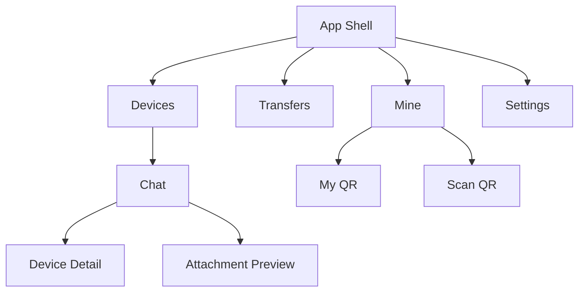

# Hydrop UI 设计规范

更新时间：2026-05-21

本文定义 Hydrop 的新版 UI 风格、响应式布局、页面结构、组件规则和交互方式。本文是后续 Flutter 实现的唯一 UI 设计依据。实现时必须继续遵循项目分层约束：`presentation` 只消费 application provider / controller，不直接修改数据层、持久化层或网络层。

## 1. 设计目标

Hydrop 是一个以设备为联系人、以聊天页为传输主界面的局域网文件传输应用。新版 UI 目标不是“玻璃感聊天软件”，而是更克制、更结构化的黑白灰工作台界面。

核心要求：

- 全页面重写，统一视觉语言。
- 保留 Material 组件体系。
- 只改 UI，不改数据层结构。
- 深色和浅色两套主题统一设计。
- 所有主要容器、输入框、按钮、导航、卡片使用 `0` 圆角。
- 页面像表格一样组织：只保留区域之间的 `2px` 内部分割线，不绘制页面外框或卡片外框。
- 不使用每日壁纸、图片背景或大面积装饰背景。
- 桌面端全局左侧导航；聊天页内部是左侧设备列表、右侧聊天内容。
- 手机端单栏，使用底部导航。
- 使用 `intl` / Flutter gen-l10n 支持简体中文、繁体中文、英语三语。

## 2. 视觉风格

### 2.1 关键词

- 黑白灰
- 直角
- 内部分割线
- 高密度
- 克制
- 工具化
- 聊天式文件传输

### 2.2 风格定义

新版 Hydrop 采用黑白灰单色系，不依赖品牌色塑造界面。页面层次主要通过背景明度、文本层级、`2px` 内部分割线、留白和局部反差建立，而不是通过大圆角、玻璃模糊、彩色状态块、图片背景和厚重阴影建立。

在线状态不使用绿色、蓝色等强调色。在线设备直接使用正常文本色和正常分割线；不在线设备通过整条文本信息降灰表达。

### 2.3 色彩规则

浅色主题：

- 页面背景：浅灰或近白
- 面板背景：纯白或极浅灰
- 主文本：接近纯黑
- 次文本：中灰
- 弱文本：浅灰
- 分割边框：中浅灰，固定 `2px`

深色主题：

- 页面背景：接近纯黑
- 面板背景：深灰
- 主文本：近白
- 次文本：中浅灰
- 弱文本：深浅之间的低对比灰
- 分割边框：中深灰，固定 `2px`

硬性要求：

- 页面层禁止自行硬编码颜色，必须统一来自 `AppTheme.light` / `AppTheme.dark`。
- 状态变化优先通过文本层级和边框对比表达，不靠鲜艳颜色提示。
- 不在线设备：名称、摘要、速度、最后一次传输全部降灰。

### 2.4 形状和分割线

- 所有核心 UI：`0` 圆角
- 页面分区：只画相邻区域之间的 `2px` 内部分割线
- 页面外层容器：不画外框
- 列表项、消息块、信息块：不画完整四边外框，优先使用底部分割线或右侧分割线
- 输入框边框：默认 `2px`
- 输入框聚焦：边框颜色加深，仍保持 `2px`
- 列表分割：优先实线分区，不用卡片阴影
- 按钮：矩形直角，不用 pill，不用胶囊

### 2.5 阴影和透明度

- 默认不依赖阴影建立层级
- 仅在底部导航、侧边导航、bottom sheet 顶层容器使用非常轻的阴影
- 不使用大面积玻璃模糊
- 不使用悬浮果冻风视觉

## 3. 总体信息架构

Hydrop 的核心结构保持“设备即联系人”的产品心智，但表现方式从 Telegram 式玻璃聊天 UI，切换为更偏桌面工具布局。

## 4. 响应式布局

### 4.1 总规则

- 手机：单栏
- 桌面：全局左导航
- 聊天页桌面内部：左设备列表 + 右聊天内容
- 不按设备型号分支，只按窗口宽度分支

### 4.2 窗口等级

| 等级 | 宽度 | 导航 | 内容结构 |
| --- | --- | --- | --- |
| Compact | `< 600` | 底部导航 | 单栏页面栈 |
| Medium | `600 - 839` | 底部导航 | 单栏，信息密度略提升 |
| Expanded | `840 - 1199` | 左侧导航 | 全局左导航 + 内容区 |
| Large | `>= 1200` | 左侧导航 | 全局左导航 + 内容区，聊天页内部双栏更稳定 |

### 4.3 页面结构

手机：

- 底部导航：`Devices / Transfers / Mine / Settings`
- `Devices` 点击某台设备后进入 `Chat`
- 所有弹窗统一使用 `showModalBottomSheet`

桌面：

- 最左侧是全局导航
- 右侧是当前页面内容
- 当前页面为聊天时，再拆成：
  - 左侧设备列表
  - 右侧聊天内容

桌面聊天结构：

| 区域 | 内容 |
| --- | --- |
| 全局左导航 | Devices / Transfers / Mine / Settings |
| 页面左栏 | 设备列表、搜索、刷新、扫码 |
| 页面右栏 | 当前设备聊天内容、输入栏、会话状态 |

## 5. 全局视觉系统

### 5.1 页面骨架

全应用页面统一由三层组成：

1. 背景层
2. 导航与分区层
3. 内容层

分层方式依靠内部分割线和背景明度差实现，不靠大卡片浮层，不给页面最外层补外框。

### 5.2 导航规则

手机：

- 使用底部导航栏
- 直角
- 上边 `2px` 分割线
- 选中项只通过文字加重、icon 加重、背景轻微反差体现

桌面：

- 使用左侧固定导航栏
- 导航栏右侧有 `2px` 垂直分割线
- 当前选中项使用实底浅反差块或边框加深
- 不使用圆形或胶囊型选中背景

### 5.3 AppBar 规则

- 页面顶部不做悬浮玻璃风
- 顶部区域就是页面结构的一部分
- 底部使用 `2px` 分割线
- 标题对齐规整，不做大标题压缩动画

### 5.4 按钮规则

- 全部直角矩形
- 主按钮：实底
- 次按钮：描边
- 危险按钮：仅在删除、清理等动作中使用更强对比
- hover：背景轻微变化
- pressed：轻微压暗或缩放

### 5.5 输入框规则

- 全部方形
- 默认边框 `2px`
- 聚焦后边框颜色加深
- 不做 glow，不做蓝色强高亮
- 输入框内留白规整，偏桌面工具风格

### 5.6 本地化规则

- 所有用户可见文案必须进入 `lib/l10n/*.arb`。
- 默认支持语言：英语 `en`、简体中文 `zh`、繁体中文 `zh_Hant`。
- 设置页提供语言切换：`System / English / 简体中文 / 繁體中文`。
- 页面标题、导航、按钮、空状态、错误提示、Snackbar、bottom sheet、消息状态和传输状态均通过 `AppLocalizations` 读取。
- 字节单位、进度文本、方向、发送状态、保存状态和传输状态统一通过公共格式化入口输出，页面内不直接拼接 `KB/MB/GB/B` 等单位。

## 6. 页面设计

### 6.1 Devices 页面

这是首页，也是主工作入口。

#### 页面元素

- 顶部标题：`Devices`
- 搜索框
- 刷新按钮
- 扫码按钮
- 设备列表
- 空状态引导

#### 设备列表项显示内容

- 名称
- 速度
- 最后一次传输

状态规则：

- 在线：使用正常文本颜色
- 不在线：整项信息降灰

不显示彩色在线点作为唯一状态表达。可以保留状态文案，但颜色必须服从黑白灰体系。

#### 列表项样式

- 高度稳定
- `0` 圆角
- 上下或左右通过 `2px` 内部分割线区隔
- 不画单个列表项的四边外框
- 选中项可使用轻微底色反差，但不改变结构

#### 空状态

- 标题：`No devices`
- 说明：引导刷新或扫码
- 操作：`Refresh`、`Scan QR`

### 6.2 Chat 页面

这是设备聊天和文件传输的主界面。

#### 手机布局

- 顶部 AppBar
- 中间消息列表
- 底部输入栏

#### 桌面布局

- 页面内部双栏
- 左侧设备列表
- 右侧聊天内容

#### 聊天区域元素

- 设备标题
- 连接状态或会话摘要
- 消息搜索
- 设备信息 bottom sheet
- 消息时间线
- 附件消息
- 附件详情 bottom sheet
- 输入栏

#### 消息样式

- 保持左右分布
- 气泡允许保留发送/接收差异
- 但外观也要改成直角风格
- 气泡本体、附件卡片、时间标签全部避免圆角化

#### 输入栏

- 方形文本框
- 左侧附件按钮
- 右侧发送按钮
- 聚焦后边框加深

#### 动效

- 新消息：淡入 + 轻微位移
- 发送后本地立即出现 pending 消息，然后通过 TCP 尝试发送并更新为 sending / sent / failed
- 文件选择后走文件传输协调器，失败时仍保留本地文件消息和失败原因
- 文件进度：仅补间进度条

### 6.3 Transfers 页面

#### 页面元素

- 顶部标题：`Transfers`
- 状态筛选
- 搜索框
- 任务列表
- 任务详情区域或 bottom sheet

#### 每个任务显示

- 文件名
- 方向
- 目标设备
- 传输状态
- 进度
- 速度
- 剩余信息
- 保存附件动作

#### 布局

手机：

- 单列表
- 点击任务打开 bottom sheet

桌面：

- 左列表右详情，或单列表加内嵌详情区

### 6.4 Mine 页面

#### 页面元素

- Device profile
- My QR
- Scan QR
- Local network
- Diagnostics

#### 布局

手机：

- 单列顺序排列

桌面：

- 用规则网格或上下分区
- 区域之间使用 `2px` 内部分割线
- 不使用外框卡片包裹整个分区

#### 交互

- `My QR` 用 bottom sheet
- `Scan QR` 用 bottom sheet
- Device ID / IP 支持复制

### 6.5 Settings 页面

#### 页面元素

- Appearance
- Transfer
- Discovery
- Privacy
- About

#### 布局

手机：

- 单列设置组

桌面：

- 左侧设置组列表
- 右侧设置详情

#### 组件规则

- `ListTile`
- `SwitchListTile`
- `SegmentedButton`
- `TextField`
- `DropdownMenu`

全部改成直角风格；页面结构只使用 `2px` 内部分割线，交互控件自身可保留必要的聚焦或描边状态。

### 6.6 QR 展示页 / QR 扫码页

不再使用 `Dialog` 风格作为主标准。

统一要求：

- 使用 `showModalBottomSheet`
- 内容区域有明确高度约束
- 顶部有标题和关闭按钮
- 主内容区和说明区之间使用分割线或留白分层
- 不使用图片背景或每日壁纸作为弹层背景

## 7. 组件设计规范

### 7.1 Navigation

- 手机底部导航：顶部 `2px` 边框
- 桌面左侧导航：右侧 `2px` 边框
- 选中项：文本加重 + 背景轻反差

### 7.2 List Item

- 统一最小高度
- `0` 圆角
- 通过内部分割线或底色差异分组
- 不使用阴影卡片

### 7.3 Buttons

- 矩形
- 主按钮与次按钮通过填充 / 描边区分
- hover 和 pressed 变化克制

### 7.4 TextField

- 方形
- `2px` 边框
- 聚焦边框加深
- 禁止胶囊输入栏

### 7.5 Bottom Sheet

- 所有弹层统一 `showModalBottomSheet`
- 可以保留顶部拖拽区域，也可以只保留标题栏
- 弹层内部仍保持直角风格

### 7.6 Message Bubble

- 左右分布不变
- 外观改为更平直的直角消息块
- 附件消息卡片也保持直角
- 消息块和附件块不画完整四边外框，附件和详情之间使用内部分割线
- 状态图标和时间用低对比文本色

## 8. 动效规范

整体原则：克制、清晰、低干扰。

- 页面切换：fade + slide
- 列表选中：底色变化
- 输入框聚焦：边框加深
- Bottom sheet：从底部上滑
- 新消息：轻微淡入
- 进度更新：只补间条形进度

不做：

- 大面积弹性动画
- 夸张缩放
- 果冻感导航
- 明显毛玻璃流动感

## 9. 可访问性和密度

- 所有 icon-only 按钮必须有 tooltip 和语义标签
- 文本层级必须清楚
- 长设备名、长文件名、长路径必须截断或折行，不允许破坏布局
- 键盘、鼠标、触控都要可用
- 桌面端优先支持键盘发送、搜索和关闭弹层

## 10. 实现约束

- 保持 Material 组件体系
- 不修改数据层
- 主题差异统一由 `AppTheme.light` / `AppTheme.dark` 提供
- 页面层禁止硬编码黑白灰颜色，必须通过主题取值
- presentation 只消费 provider / controller

## 11. 后续实现顺序

1. 先重建全局主题 token：黑白灰、内部分割线、文本层级、直角形状
2. 重写 App Shell：手机底部导航、桌面左侧导航
3. 重写 Devices 页面
4. 重写 Chat 页面和桌面内双栏
5. 重写 Transfers 页面
6. 重写 Mine 页面
7. 重写 Settings 页面
8. 统一 bottom sheet 样式
9. 收尾各组件动效与状态

## 12. 当前确认结论

以下内容已经由需求确认：

- 风格：深浅两套主题
- 配色：黑白灰
- 圆角：全部 `0`
- 分区方式：只保留 `2px` 内部分割线，不画页面外框或卡片外框
- 背景：不使用每日壁纸或图片背景
- 页面范围：所有页面全部重写
- 响应式：手机单栏，桌面双层结构
- 全局桌面布局：左侧导航
- 聊天页桌面布局：左设备列表，右聊天内容
- 组件要求：手机底部导航、桌面侧边导航、聊天输入栏方形、聚焦边框加深、弹窗统一 bottom sheet
- 设备列表信息：名称 / 速度 / 最后一次传输
- 在线状态：正常文本颜色
- 不在线状态：灰色文本
- 约束：继续使用 Material，只改 UI，不改数据层
