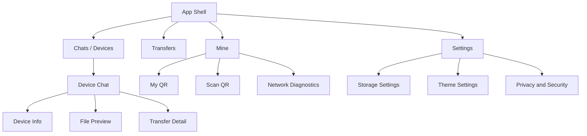

# Hydrop UI 设计规范

更新时间：2026-05-20

本文定义 Hydrop 的产品界面、响应式布局、页面结构、视觉风格和交互动画。本文只写设计文档，不新增 Flutter 代码；后续实现必须继续遵循 `README.md`、`docs/architecture_design.md` 和 `lib/data/local/DRIFT.md` 的分层边界：`presentation` 只消费 application provider / controller，不直接操作 Drift、Socket、Dio 或平台 API。

## 1. 产品定位

Hydrop 是一个面向局域网的跨端文件传输与轻量聊天应用。产品形态采用“聊天软件联系人列表”的心智：**每一台远端设备都是一个联系人**，文本、图片、视频和文件传输都进入与该设备的同一个会话时间线。

核心闭环：发现设备 -> 设备进入联系人列表 -> 打开会话 -> 发送文本或文件 -> 展示传输进度和校验结果 -> 本地保存历史。

### 1.1 设计关键词

- **Telegram 式结构**：左侧联系人 / 会话列表，中间聊天时间线，右侧详情 / 传输队列；移动端按页面栈切换。
- **Apple 式氛围**：毛玻璃、悬浮层、柔和阴影、圆角、轻量弹性动画、半透明导航和底部操作区。
- **Material 实现**：所有控件优先用 Flutter Material 组件或 Material 可组合能力实现，再通过主题、形状、透明度、模糊和动画做 Apple-like 视觉，不引入 Cupertino 作为主 UI 框架。
- **局域网可信感**：设备在线、测速、IP、传输速度、校验状态要清楚可见，让用户知道“为什么现在可传 / 不可传”。

### 1.2 官方设计依据

- Flutter adaptive & responsive 文档：根据可用空间构建 UI，不按设备型号分支。
- Flutter layout constraints：遵循“父级下发约束，子级上报尺寸，父级决定位置”。
- Flutter large screens best practices：支持可调整窗口、多窗口、键盘、鼠标、触控板等输入方式。
- Material / Android window size class：使用 compact、medium、expanded 等窗口等级规划导航和内容密度。

参考：

- [Flutter Adaptive and responsive apps](https://docs.flutter.dev/ui/adaptive-responsive)
- [Flutter General approach](https://docs.flutter.dev/ui/adaptive-responsive/general)
- [Flutter Best practices for adaptive apps](https://docs.flutter.dev/ui/adaptive-responsive/best-practices)
- [Flutter Layout constraints](https://docs.flutter.dev/ui/layout/constraints)
- [Android Window size classes](https://developer.android.com/develop/ui/compose/layouts/adaptive/use-window-size-classes)
- [Material 3 Adaptive layout](https://m3.material.io/foundations/layout/applying-layout/window-size-classes)

## 2. 总体信息架构

### 2.1 页面地图

### 2.2 主页面

| 页面 | 角色 | 显示内容 | 主要操作 |
| --- | --- | --- | --- |
| Chats / Devices | Telegram 式首页，把设备作为联系人 | 设备头像、名称、在线状态、最后消息、传输摘要、未读数、测速 | 搜索、刷新发现、扫码添加、打开会话 |
| Device Chat | 单设备会话页 | 消息时间线、文件气泡、传输进度、输入栏、设备状态 | 发送文本、选择文件、拖拽文件、重试失败任务 |
| Transfers | 全局传输队列 | 发送中、接收中、失败、已完成任务 | 暂停、继续、重试、清理、打开所在会话 |
| Mine | 本机设备页 | 本机设备名、Device ID、可用 IP、二维码、网络权限状态 | 展示二维码、扫码连接、刷新本机网络信息 |
| Settings | 设置页 | 主题、保存目录、发现广播、连接超时、隐私安全 | 切换主题、修改传输策略、清理历史 |

### 2.3 二级页面 / 弹层

| 页面 / 弹层 | 触发方式 | 内容 | 样式 |
| --- | --- | --- | --- |
| Device Info | 聊天页 header 或联系人右键 | 设备资料、所有 IP、测速历史、连接状态、清空会话 | 桌面右侧浮层，移动端 bottom sheet / 全屏页 |
| File Preview | 点击图片 / 视频 / 文件气泡 | 缩略图、文件名、大小、保存路径、打开 / 分享 | 半透明背景 + 浮动预览卡片 |
| Transfer Detail | 点击传输进度 | 分片进度、速度、校验、失败原因、重试 | 浮动详情面板 |
| My QR | Mine 页按钮 | 本机连接二维码、设备名、IP 数量、协议版本 | 玻璃 Dialog，二维码白底卡片 |
| Scan QR | Mine / Chats 添加入口 | 扫描框、平台能力提示、识别状态 | 全屏或大 Dialog，扫描框悬浮描边 |
| Network Diagnostics | Mine 页入口 | 网卡、IP、广播地址、网关、权限提示 | 卡片列表 / 桌面表格 |

## 3. 响应式布局规则

### 3.1 窗口等级

| 等级 | 宽度 | 导航 | 页面结构 |
| --- | --- | --- | --- |
| Compact | `< 600dp` | 底部悬浮导航栏 | 单页面栈：联系人列表 -> 聊天 -> 详情 |
| Medium | `600dp - 839dp` | 底部悬浮导航栏或窄 Rail | 联系人列表可两列，聊天仍单页进入 |
| Expanded | `840dp - 1199dp` | 左侧悬浮 NavigationRail | 双栏：联系人列表 + 当前聊天 |
| Large | `>= 1200dp` | 左侧悬浮 NavigationRail | 三栏：联系人列表 + 聊天 + 详情 / 传输队列 |

实现约束：

- 页面级布局基于 `LayoutBuilder.constraints.maxWidth` 判断，不基于硬件类型或系统平台。
- 只在应用根、全屏弹层、安全区处理时使用 `MediaQuery.sizeOf`、`MediaQuery.paddingOf`、`MediaQuery.viewInsetsOf`。
- 不使用屏幕方向作为主要布局条件；不锁定横竖屏。
- 列表用 `ListView.builder` / `GridView.builder`；大屏内容必须用 `ConstrainedBox` 限制最大宽度，避免整行拉伸。

### 3.2 布局切换

Compact：

- `Chats / Devices` 是首页。
- 点击设备后 push 到 `Device Chat`。
- 设备详情、文件预览、传输详情用 bottom sheet 或全屏 route。
- 底部悬浮导航栏显示 Chats、Transfers、Mine、Settings。

Expanded：

- App Shell 左侧显示悬浮 NavigationRail。
- Rail 右侧是联系人列表，宽度 `320dp - 380dp`。
- 当前聊天占据中间剩余空间。
- 点击联系人只切换中间聊天，不发生整页跳转。

Large：

- 左侧 Rail 宽度约 `80dp`，联系人列 `360dp - 420dp`。
- 中间聊天列最大宽度可放宽，但消息气泡仍限制宽度。
- 右侧显示设备详情或传输队列，宽度 `320dp - 380dp`。
- 当没有选中联系人时，中间显示欢迎页和连接引导。

## 4. 视觉风格：Material 组件模拟 Apple 悬浮玻璃

### 4.1 总体风格

Hydrop 的 UI 使用 Flutter Material 组件作为基础，但外观统一做成 Apple-like 浮层：

- AppBar、导航栏、按钮、输入栏、卡片都以悬浮玻璃层呈现。
- 背景使用每日一图或柔和渐变；内容层浮在背景之上，而不是平铺白底页面。
- 圆角大、边框轻、阴影柔，避免厚重 Material 默认填充块。
- 操作控件有轻微缩放、透明度、模糊和滑动动效，给出“轻”和“弹”的触感。

### 4.2 Material 组件映射

| 目标控件 | Material 基础 | Hydrop 样式 |
| --- | --- | --- |
| 悬浮 AppBar | `AppBar` / `SliverAppBar` / 自定义 `PreferredSize` | 透明背景、`BackdropFilter`、圆角胶囊或圆角矩形、下方阴影 |
| 悬浮底部导航 | `NavigationBar` / `BottomAppBar` | 外层 `HdGlassDock`，pill 选中态，居中悬浮，不贴边 |
| 悬浮侧边导航 | `NavigationRail` | 玻璃容器包裹，圆角 `28dp`，icon pill 选中态 |
| 联系人列表项 | `ListTile` / `InkWell` | 圆角玻璃或透明 row，选中后半透明高亮，hover 轻亮 |
| 主按钮 | `FilledButton` | 胶囊形，半透明 primary，轻阴影，pressed 缩放 |
| 次按钮 | `FilledButton.tonal` / `OutlinedButton` | 低透明玻璃底，细边框 |
| 输入栏 | `TextField` | 浮动玻璃输入框，圆角 `22dp`，附件按钮和发送按钮嵌入 |
| 弹窗 | `Dialog` / `AlertDialog` / `ModalBottomSheet` | 玻璃面板、大圆角、背景 dim + blur |
| 进度 | `LinearProgressIndicator` / `CircularProgressIndicator` | 细进度条嵌在文件气泡中，显示百分比和速度 |

### 4.3 颜色与透明度

- 浅色主题：背景明亮，玻璃层 `surface` alpha 约 `0.52 - 0.68`，边框 alpha `0.10 - 0.16`。
- 深色主题：背景暗化，玻璃层 `surface` alpha 约 `0.28 - 0.42`，边框 alpha `0.16 - 0.24`。
- 联系人选中态：`primary` alpha `0.14 - 0.22`，文字和 icon 使用 `primary`。
- 在线状态：绿色语义色 + “Online” 文案；离线状态使用灰色 + “Last seen ...”；失败使用 `ColorScheme.error`。
- 不只用颜色表达状态，必须同时出现文案或图标。

### 4.4 圆角、阴影、模糊

| 元素 | 圆角 | 模糊 | 阴影 |
| --- | --- | --- | --- |
| Floating AppBar | `26dp - 30dp` | `16 - 22` | `0 12 32` 低透明 |
| Bottom Dock | `28dp - 34dp` | `18 - 24` | `0 18 40` 中透明 |
| NavigationRail 容器 | `30dp` | `18 - 24` | `0 16 36` |
| 联系人选中背景 | `18dp - 22dp` | 可无 | 轻阴影或无阴影 |
| 消息气泡 | `18dp - 24dp` | 可无或低模糊 | 文件气泡可有轻阴影 |
| Dialog / Sheet | `28dp - 34dp` | `20 - 28` | `0 24 60` |

## 5. App Shell 规划

### 5.1 Compact App Shell

元素：

- 背景层：每日一图 / 渐变 + 氛围光斑。
- 页面内容：占满安全区，底部预留 Dock 高度。
- 悬浮底部导航：Chats、Transfers、Mine、Settings。
- 中央主操作：在 Chats 页可显示“扫码 / 添加设备”的 floating action pill。

样式：

- Dock 不贴底，距离底部安全区 `12dp - 16dp`。
- Dock 宽度不超过 `560dp`，在手机上左右留 `20dp`。
- 选中 tab 为胶囊高亮，icon + label 同时显示。

动画：

- Tab 切换使用 fade + 轻微 vertical slide，时长 `180ms - 240ms`。
- Dock 进入页面时从底部上浮，带 `easeOutCubic`。
- 键盘弹起时 Dock / 输入栏跟随 `viewInsets.bottom` 平滑上移。

### 5.2 Expanded / Large App Shell

元素：

- 左侧悬浮 NavigationRail：Chats、Transfers、Mine、Settings。
- 中间内容区域：根据当前 tab 显示联系人 / 聊天 / 设置。
- Large 右侧辅助栏：设备详情、传输队列或诊断摘要。

样式：

- Rail 为独立玻璃胶囊，距离窗口左侧和上下各 `20dp - 28dp`。
- Rail icon 选中态使用 pill 背景，不使用硬边矩形。
- 页面列之间用透明间距和轻分割线，不使用重色 divider。

动画：

- 从 Compact 到 Expanded 时，底部 Dock 淡出，Rail 从左侧滑入。
- 右侧辅助栏出现时从右侧滑入，宽度变化使用 `AnimatedSize`。
- Hover 到 Rail icon 时轻微放大 `1.03`，pressed 缩小 `0.97`。

## 6. Chats / Devices 首页

这是 Hydrop 的主首页，视觉上模仿 Telegram 的会话列表，但每个条目代表一台设备联系人。

### 6.1 页面元素

悬浮 AppBar：

- 左侧：应用标题 `Hydrop`，副标题显示局域网状态，例如 `3 devices nearby`。
- 中间 / 下方：搜索框，placeholder 为 `Search devices or messages`。
- 右侧：刷新发现、扫码添加、更多菜单。

联系人列表：

- 设备头像：圆形渐变头像，显示设备名首字母或设备类型图标。
- 设备名：`displayName`。
- 在线状态：Online、Connecting、Offline、Last seen 2m ago。
- 最后一条摘要：最后文本消息、文件名、`Photo`、`Video`、`File completed`、`Transfer failed`。
- 右侧时间：最后消息 / 最后发现时间。
- 未读数：圆形 badge。
- 连接质量：小 pill，如 `12 ms`、`24 MB/s`、`No route`。

空状态：

- 中央插画式玻璃卡片：`No nearby devices yet`。
- 说明：`Keep devices on the same Wi-Fi or scan a QR code.`。
- 主按钮：`Scan QR`。
- 次按钮：`Refresh discovery`。

### 6.2 布局

Compact：

- AppBar 悬浮在顶部安全区下方。
- 搜索框作为 AppBar 内第二行或独立悬浮搜索 pill。
- 联系人列表单列，列表底部 padding 避开 Dock。

Expanded / Large：

- 联系人列固定宽度，顶部悬浮搜索，列表在列内滚动。
- 选中联系人后该 row 有 Telegram-like pill 高亮。
- 中间聊天区域展示当前会话；未选中时展示欢迎页。

### 6.3 交互动画

- 列表项首次加载：按 index 做 `20ms - 30ms` staggered fade + slide。
- 下拉刷新：AppBar 下方出现轻量进度条，不遮挡列表。
- 搜索聚焦：搜索 pill 宽度轻微扩展，背景透明度增加。
- 选中联系人：选中背景从点击位置扩散或淡入，头像轻微缩放。
- 设备状态变化：状态 pill 使用 cross-fade，避免突然跳字。

## 7. Device Chat 会话页

### 7.1 页面元素

悬浮 Chat AppBar：

- 左侧：返回按钮（Compact）、设备头像、设备名。
- 副标题：在线状态 + 当前连接质量，例如 `Online · 12 ms · 24 MB/s`。
- 右侧：搜索消息、设备信息、更多菜单。

消息时间线：

- 日期分隔 pill：`Today`、`Yesterday`。
- 文本气泡：自己发送靠右，接收靠左。
- 图片 / 视频气泡：缩略图、尺寸、加载占位、预览入口。
- 文件气泡：文件图标、文件名、大小、进度条、速度、状态。
- 系统消息：设备连接、断开、切换 IP、校验失败等。

底部悬浮输入栏：

- 附件按钮：选择图片 / 视频 / 文件。
- 文本输入框：placeholder `Message or drop a file`。
- 发送按钮：有文本时为发送，无文本时可显示文件快捷按钮。
- 传输中小提示：当前会话有文件传输时，输入栏上方显示 compact transfer strip。

### 7.2 消息气泡样式

- 自己发送：使用 `primary` 半透明气泡，右下角可略微不同圆角。
- 对方消息：使用 `surface` 玻璃气泡，左下角可略微不同圆角。
- 文件气泡：更像 Telegram 文件卡片，左侧文件类型 icon，中间文件名和状态，底部进度条。
- 失败气泡：边框或状态 icon 使用 `error`，保留重试按钮。
- 消息最大宽度：Compact 为屏宽 `78%`，Expanded 为聊天列 `62% - 68%`，Large 不无限变宽。

### 7.3 交互动画

- 新消息进入：从底部轻微 slide + fade，自己消息可从右下进入。
- 发送文本：点击发送后输入框清空，pending 气泡立即出现。
- ACK 到达：pending spinner cross-fade 为 sent check。
- 文件上传：进度条平滑补间；完成后显示短暂 success pulse。
- 失败：气泡轻微 shake 一次，随后稳定显示错误和重试按钮。
- 拖拽文件进入桌面聊天区：聊天区出现蓝色玻璃 overlay，文案 `Drop to send to this device`。
- 滚动到底部：新消息按钮悬浮在输入栏上方，点击平滑滚动到底部。

### 7.4 响应式

Compact：

- 聊天页是独立 route。
- AppBar 和输入栏都悬浮，列表上下 padding 避开它们。
- 文件预览使用全屏页面或 bottom sheet。

Expanded：

- 聊天页嵌在 App Shell 中间列。
- 左侧联系人列表常驻。
- 设备详情通过右侧浮层或右栏打开。

Large：

- 右栏默认显示当前设备详情和本会话传输队列。
- 文件预览可在右栏展开，不打断聊天。

## 8. Transfers 全局传输页

### 8.1 页面元素

悬浮 AppBar：

- 标题：`Transfers`。
- 筛选 tabs：All、Sending、Receiving、Failed、Completed。
- 右侧：清理完成任务、暂停全部、更多菜单。

传输任务列表：

- 文件类型 icon / 缩略图。
- 文件名、目标设备、方向（发送 / 接收）。
- 状态：Queued、Transferring、Verifying、Completed、Failed、Paused。
- 进度：百分比、已传输 / 总大小、速度、剩余时间。
- 操作：暂停、继续、重试、取消、打开会话、在文件夹中显示。

### 8.2 布局

Compact：

- 分组列表，失败任务置顶。
- 筛选 tabs 为横向滚动 pill。
- 点击任务进入 Transfer Detail bottom sheet。

Expanded / Large：

- 左侧任务列表，右侧任务详情。
- Large 可在聊天页右栏复用同一传输队列组件。

### 8.3 交互动画

- 任务进入队列：从顶部或当前会话 fly-in 到列表。
- 进度更新：只补间进度条，不频繁重建整行。
- 筛选切换：列表 cross-fade + size animation。
- 清理完成任务：completed 分组向上收起。

## 9. Mine 本机页

### 9.1 页面元素

悬浮 AppBar：

- 标题：`Mine`。
- 副标题：本机网络状态，例如 `Ready on Wi-Fi`。
- 右侧：刷新、设置入口。

Device Profile 卡片：

- 本机头像 / 设备图标。
- Display name、Host name、Device ID。
- Device ID 可复制，长按 / 右键显示 copy。

QR Connection 卡片：

- `My QR`：显示本机连接二维码。
- `Scan QR`：扫描对方二维码。
- 协议版本、TCP port、可用地址数量。
- 平台不支持扫描时显示 disabled 状态和说明。

Local Network 卡片：

- IP 列表：interface name、IPv4 / IPv6、gateway、subnet、broadcast。
- 每个 IP 支持复制。
- 权限 / 网络异常时显示诊断提示。

Diagnostics 卡片：

- UDP broadcast 状态。
- TCP server 状态。
- 最近发现时间。
- 最近错误。

### 9.2 布局

Compact：

- 单列卡片，顺序为 Profile -> QR -> Local Network -> Diagnostics。
- QR dialog 宽度不超过屏幕减 `40dp`。

Expanded：

- 两列网格：Profile + QR 在上，Local Network 跨列或占较宽列。

Large：

- 三列：Profile、QR、Diagnostics；Local Network 使用宽表格占底部或右侧。

### 9.3 交互动画

- 刷新本机网络：AppBar refresh icon 旋转，IP 卡片 cross-fade。
- 展示二维码：Dialog scale + fade，背景轻 blur。
- 扫描二维码：扫描框描边缓慢 breathing，识别成功后绿色 pulse。
- 复制 IP / Device ID：被复制行出现短暂 highlight + SnackBar。

## 10. Settings 设置页

### 10.1 页面元素

设置分组：

- Appearance：System / Light / Dark、背景图开关、玻璃强度。
- Transfer：保存目录、自动接收、并发数、失败重试次数。
- Discovery：广播开关、发现间隔、设备过期时间、二维码连接。
- Privacy：设备 ID 说明、清空聊天历史、清理附件、隐藏本机名称。
- About：版本号、协议版本、开源许可。

### 10.2 样式

- 使用 `ListTile` / `SwitchListTile` / `SegmentedButton` / `Slider` 等 Material 组件。
- 每个分组包裹在 `HdGlassPanel` 中。
- Compact 单列，Expanded 以上左侧分组导航，右侧设置详情。

### 10.3 交互动画

- 切换主题：整个页面颜色 cross-fade，玻璃层透明度平滑补间。
- 调整玻璃强度：预览卡片实时变化，但持久化操作 debounce。
- 清理历史：二次确认 Dialog 使用危险色按钮，不直接执行。

## 11. 通用组件规范

### 11.1 Floating AppBar

- 所有页面顶部都使用悬浮风格，不使用贴边硬 AppBar。
- AppBar 背后内容滚动时，AppBar 维持玻璃模糊。
- AppBar 可根据滚动状态从大标题压缩为小标题。
- Compact 下高度可为 `64dp - 96dp`，含搜索时可到 `112dp`。

### 11.2 Floating Navigation

- 移动端底部导航：悬浮 `HdGlassDock`，不贴边，不全宽硬底色。
- 桌面端侧边导航：悬浮玻璃 `NavigationRail`，不使用普通 drawer。
- 所有导航项要有 selected、hover、pressed、disabled 四种状态。

### 11.3 Floating Buttons

- 主按钮使用 pill，最小高度 `48dp`。
- Icon button 视觉为圆形玻璃按钮，触控区域不小于 `48dp x 48dp`。
- Pressed 动画：scale `0.97`，时长 `90ms - 120ms`。
- Hover 动画：背景透明度增加，icon 轻微上浮或放大。

### 11.4 Contact Tile

联系人条目是首页最重要的组件：

- 高度：Compact `72dp - 84dp`，桌面 `68dp - 76dp`。
- 左侧头像：`48dp - 54dp`，在线状态点贴在右下。
- 中间两行：设备名 + 消息摘要。
- 右侧两行：时间 + 未读数 / 质量 pill。
- 选中态：整行出现圆角 pill 背景，不改变列表宽度。

### 11.5 Message Bubble

- 文本气泡支持长按 / 右键菜单：复制、删除、重发。
- 文件气泡支持打开、保存、重试、取消。
- 气泡内时间和状态 icon 靠右下，颜色低透明。
- 系统消息使用居中小 pill，不使用普通聊天气泡。

### 11.6 Empty / Error / Permission State

- 所有空态使用玻璃卡片 + 图标 + 一句话解释 + 主操作。
- 错误态显示用户可理解的原因，不直接暴露原始异常作为唯一内容。
- 权限态明确说明缺少相机、网络、本地文件权限，并给出重试或设置入口。

## 12. Motion 交互动画规范

### 12.1 动画原则

- 动画表达层级和状态变化，不做无意义装饰。
- 默认时长 `160ms - 280ms`；页面级切换最多 `320ms`。
- 曲线优先 `easeOutCubic`、`easeInOutCubic`，重要浮层可用轻微弹性曲线。
- 尊重系统减少动态效果设置；必要时降级为 fade。

### 12.2 页面级动画

| 场景 | 动画 |
| --- | --- |
| App 启动 | 背景先出现，AppBar / 列表 / Dock 依次 fade + slide |
| Tab 切换 | 内容 fade + 轻微横向 slide，导航选中 pill 平滑移动 |
| 打开聊天 | Compact push；Expanded 中间聊天 cross-fade + 联系人选中高亮 |
| 打开详情栏 | 右栏 slide in + `AnimatedSize` |
| 打开 Dialog | 背景 dim + blur，面板 scale `0.96 -> 1` + fade |
| Bottom sheet | 从底部上浮，圆角保持，背景轻 blur |

### 12.3 状态动画

| 状态 | 动画 |
| --- | --- |
| 设备上线 | 头像状态点 scale in，状态文案 cross-fade |
| 设备离线 | 状态点淡出为灰色，摘要更新 Last seen |
| 新消息 | 气泡从底部 fade + slide，列表滚动到底部 |
| 未读数变化 | Badge scale / count cross-fade |
| 传输进度 | 进度条平滑补间，速度文本 cross-fade |
| 传输完成 | 文件气泡 success pulse 一次 |
| 传输失败 | 气泡轻 shake，显示 retry pill |
| 搜索 | 搜索框扩展，列表过滤结果 fade + size |

## 13. 可访问性与输入方式

- 所有 icon-only 按钮必须有 tooltip 和 semantic label。
- 触控目标不小于 `48dp x 48dp`。
- 键盘焦点顺序：导航 -> AppBar -> 列表 -> 主内容 -> 输入栏。
- 桌面端支持：Enter 发送、Shift + Enter 换行、Esc 关闭弹层、Cmd/Ctrl + F 搜索、Cmd/Ctrl + O 选择文件。
- 不只依赖颜色表达在线、失败、完成状态，必须配合文案或图标。
- 设备名、文件名、IP、路径、错误原因都必须支持长文本处理和复制。

## 14. 响应式验收清单

每个页面开发完成后，需要检查以下窗口：

- `390 x 844`：手机竖屏，Compact。
- `600 x 960`：窄平板 / 分屏，Medium。
- `900 x 700`：平板横屏 / 普通桌面，Expanded。
- `1280 x 800`：桌面，Large。
- `1440 x 1000`：宽桌面，三栏可用性。

检查项：

- AppBar、按钮、导航栏全部是悬浮风格，没有贴边硬色块。
- Compact 下联系人列表、聊天页、详情页能通过页面栈完整使用。
- Expanded 以上联系人列表和聊天内容可以并排显示。
- Large 下右侧详情 / 传输队列不会挤压聊天时间线。
- 没有 overflow，长设备名、长文件名、长 IP 不会破坏布局。
- 底部 Dock 和输入栏避开安全区、键盘和桌面窗口边缘。
- Loading、Empty、Error、Offline、Permission blocked 都有明确 UI。
- 鼠标、触控、键盘都能完成：发现设备、扫码添加、打开会话、发送文本、发送文件、重试失败任务。

## 15. 后续落地顺序

1. 先定义响应式窗口等级和浮层 token：padding、radius、blur、shadow、alpha。
2. 重构 App Shell：Compact 使用悬浮底部导航，Expanded 以上使用悬浮 NavigationRail。
3. 将 Home 改为 `Chats / Devices`：设备作为 Telegram-like 联系人列表。
4. 重构 Chat：悬浮 Chat AppBar、消息气泡、文件气泡、悬浮输入栏。
5. 增加 Transfers 全局队列页，并在 Large 右栏复用。
6. 重构 Mine：Profile、QR、Local Network、Diagnostics 卡片化和响应式网格。
7. 规划 Settings：Appearance、Transfer、Discovery、Privacy、About。
8. 补齐 motion：页面进入、联系人选中、新消息、传输进度、错误重试。
9. 做五档窗口宽度、键盘、鼠标、触控和可访问性验收。
